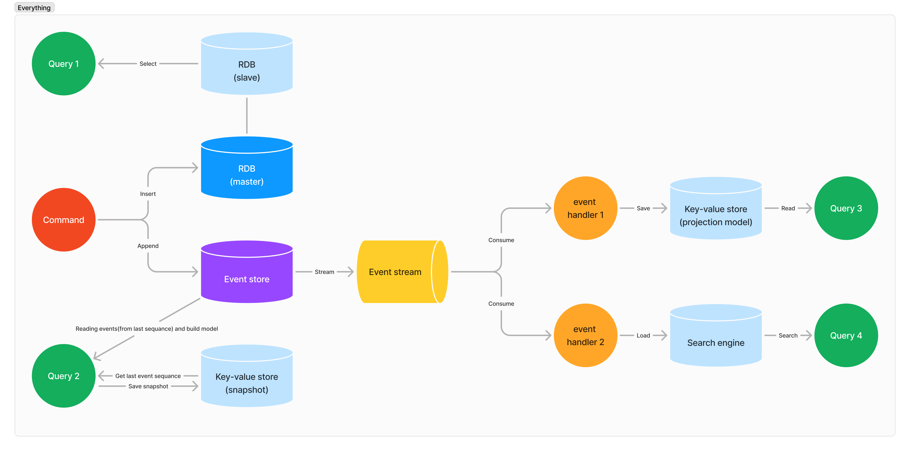
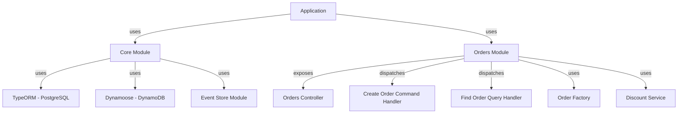

# 🚀 NestJS CQRS + DDD Architecture

<div align="center">


**A production-grade reference implementation of Domain-Driven Design, CQRS and Event Sourcing with NestJS 11 — orders domain with EventStoreDB, PostgreSQL (write) and DynamoDB (read).**

[Architecture](#-architecture) •
[Quick start](#-quick-start) •
[Project structure](#-project-structure) •
[API](#-api)

</div>

---

## ✨ What this repo demonstrates

- 🏛️ **Domain-Driven Design**: aggregates, entities, value objects, domain events, factories and domain services
- ⚖️ **CQRS**: commands and queries with dedicated handlers and repositories per side
- 📜 **Event Sourcing**: domain events persisted in EventStoreDB, with projections/materialized models for reads
- 🧅 **Vertical Slice + Hexagonal layering**: each module owns `domain / application / infrastructure / presentation`
- 🐳 **Polyglot persistence**: PostgreSQL as write store, DynamoDB Local as read store, all via docker-compose
- 📘 **OpenAPI**: Swagger docs out of the box via `@nestjs/swagger`

---

## 🏛️ Architecture



**Write path**: Controller → Command → CommandHandler → Domain (Factory, Services, Events) → EventStoreDB + PostgreSQL

**Read path**: Query → QueryHandler → DynamoDB projection (materialized model)



> 📊 More diagrams in [`diagrams/`](diagrams): components, sequence, classes and flow — plus persistence topology images in [`images/`](images).

---

## 📁 Project Structure

```
src/
├── main.ts
├── app.module.ts
├── core/                          # Shared kernel: aggregate root base, event-store port
├── shared/event-store/            # EventStoreDB integration (publisher + service)
└── orders/                        # Orders bounded context
    ├── domain/                    # Order aggregate, OrderItem, Address VO, domain events,
    │                              #   OrderFactory, DiscountService
    ├── application/
    │   ├── commands/              # CreateOrder command + handler
    │   ├── queries/               # FindOrder query + handler
    │   ├── materialized/          # Projection model for the read side
    │   └── ports/                 # Command & query repository interfaces
    ├── infrastructure/            # TypeORM + Dynamoose repositories, mappers, schemas
    └── presentation/              # OrdersController + DTOs
```

---

## 🚀 Quick Start

```bash
# 1. Clone
git clone https://github.com/Balsalobre/nestjs-cqrs-ddd-architecture.git
cd nestjs-cqrs-ddd-architecture

# 2. Install
npm install

# 3. Start infrastructure (PostgreSQL + DynamoDB Local + EventStoreDB)
docker-compose up -d

# 4. Run the API
npm run start:dev
```

Swagger UI is served at `http://localhost:3000/docs` once the app boots.

### Scripts

| Command | Description |
| --- | --- |
| `npm run start:dev` | Run in watch mode |
| `npm run build` / `start:prod` | Build & run compiled app |
| `npm test` | Unit tests (Jest) |
| `npm run test:e2e` | E2E tests (Supertest) |
| `npm run lint` / `format` | ESLint + Prettier |

---

## 🔌 API

| Method | Route | Description |
| :---: | --- | --- |
| `POST` | `/orders` | Create an order (command path, emits `OrderCreated`) |
| `GET` | `/orders/:orderId` | Fetch an order by id (query path, DynamoDB projection) |

---

## 🧱 Tech Stack

| Technology | Role |
| --- | --- |
| [NestJS 11](https://nestjs.com/) + `@nestjs/cqrs` | Framework and CQRS bus |
| [TypeORM](https://typeorm.io/) + PostgreSQL | Write-side persistence |
| [Dynamoose](https://dynamoosejs.org/) + DynamoDB Local | Read-side projections |
| [EventStoreDB](https://www.eventstore.com/) | Event sourcing store |
| `@nestjs/swagger` | OpenAPI documentation |
| Jest + Supertest | Unit and E2E testing |

---

## 🤝 Contributing

Contributions are welcome! Please open an issue or submit a pull request with your changes.

## 📄 License

This project is licensed under the MIT License. See [`LICENSE`](LICENSE) for details.

---

<div align="center">

**Built with 🏛️ by [Carlos Balsalobre](https://github.com/Balsalobre)**

</div>
